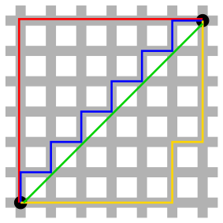

<div align="center">
  <picture>
    
  </picture>
<br>

<h2>Hsdlib</h2>

[](https://github.com/habedi/hsdlib/actions/workflows/tests_amd64.yml)
[](https://github.com/habedi/hsdlib/actions/workflows/benches_amd64.yml)
[](https://codecov.io/gh/habedi/hsdlib)
[](https://www.codefactor.io/repository/github/habedi/hsdlib)
[](docs)
[](https://github.com/habedi/hsdlib)
[](https://github.com/habedi/hsdlib/releases/latest)

Hardware-accelerated distance metrics and similarity measures for high-dimensional data

</div>

---

Hsdlib is a C library that provides hardware-accelerated implementations of popular distance metrics and
similarity measures for high-dimensional data.
It automatically picks the optimal implementation (AVX/AVX2/AVX512 or NEON/SVE) at runtime based on the
available CPU features.

### Features

- Simple unified API (see [hsdlib.h](include/hsdlib.h))
- Support for popular distances and similarity measures
    - Squared Euclidean, Manhattan, Hamming distances
    - Dot-product, Cosine, Jaccard similarities
- Support AMD, Intel, and ARM CPUs
- Support for runtime dispatch with optional manual override
- Bindings for Python (see [HsdPy](bindings/python))
- Compatible with C11 and later

---

### Getting Started

To get started with Hsdlib, you can clone the repository and build the library using the following commands:

```bash
git clone --depth=1 https://github.com/habedi/hsdlib
cd hsdlib

# Install dependencies
make install-deps

# Build the library (shared and static)
make build BUILD_TYPE=release # Default is `debug`
ls lib # Check the built libraries (libhsd.so, libhsd.a, etc.)
```

After the build is complete, you can include the [hsdlib.h](include/hsdlib.h) header file in your C (or C++) code and
link against the libraries in the `lib` directory.

### Examples

| File                                          | Description                          |
|:----------------------------------------------|:-------------------------------------|
| [hsdlib_example.c](examples/hsdlib_example.c) | Example usages of Hsdlib API (C)     |
| [hsdpy_example.py](examples/hsdpy_example.py) | Example usages of HsdPy API (Python) |

To compile and run the example(s), use the `make example` command.

### Documentation

API documentation can be generated using [Doxygen](https://www.doxygen.nl).
To generate the documentation, use the `make doc` command and then open the `doc/html/index.html` file in a web browser.

#### API Summary

| Distance or Similarity Function | Description                                                                                                           |
|:--------------------------------|:----------------------------------------------------------------------------------------------------------------------|
| `hsd_dist_sqeuclidean_f32(...)` | Compute squared Euclidean ($L2^2$) distance between two float vectors.                                                |
| `hsd_dist_manhattan_f32(...)`   | Compute Manhattan ($L1$) distance between two float vectors.                                                          |
| `hsd_dist_hamming_u8(...)`      | Compute Hamming distance between two binary or non-binary byte vectors.                                               |
| `hsd_sim_dot_f32(...)`          | Compute dot product similarity between two float vectors.                                                             |
| `hsd_sim_cosine_f32(...)`       | Compute cosine similarity between two float vectors.                                                                  |
| `hsd_sim_jaccard_u16(...)`      | Compute Jaccard similarity between two binary vectors. If vectors are not binary, Tanimoto coefficient is calculated. |

The distance and similarity functions accept the following parameters in order:

- `a`: Pointer to the first input vector (array of floats or bytes).
- `b`: Pointer to the second input vector (array of floats or bytes).
- `n`: Number of elements in the input vectors.
- `r`: Pointer to the output variable where the result will be stored.

All the functions that their names start with `hsd_dist_` or `hsd_sim_` return `hsd_status_t` as the return type.
The `HSD_SUCCESS` status indicates that the result is valid and stored in the output pointer `r`.
Anything else indicates an error.
Check out the **Types and Enums** section below for more details.

> [!NOTE]
> **N1**: Euclidean distance can easily be calculated from the squared Euclidean
> distance: $\text{euclidean}(a, b) = \sqrt{\text{squared euclidean}(a, b)}$
>
> **N2**: The implementation of the Hamming distance works both on binary and non-binary vectors.
> If the vectors are not binary, the Hamming distance is calculated using the following formula:
> `hamming(a, b) = Σᵢ popcount(a_byte[i] ⊕ b_byte[i]) / total_bits`
> where `total_bits` is `n` times 8 (the number of bits in uint8_t).
>
> **N3**: The similarity measures can be used to calculate distances (or dissimilarities) as follows:
> - Cosine distance = $1 - \text{cosine}(a, b)$
> - Jaccard distance = $1 - \text{jaccard}(a, b)$
> - Negative dot product = $-\text{dot}(a, b)$
>
> **N4**: Tanimoto coefficient formula is used to calculate the Jaccard similarity.
> Note that the formula gives the jaccard similarity for binary vectors.
> However, for non-binary vectors, the calculated similarity measure would be Tanimoto coefficient rather than Jaccard
> similarity.

| Utility Function                   | Return Type       | Description                                                                                           |
|:-----------------------------------|:------------------|:------------------------------------------------------------------------------------------------------|
| `hsd_get_backend()`                | `const char *`    | Return textual name of current backend (auto or forced).                                              |
| `hsd_has_avx512()`                 | `bool`            | Return true if AVX512F the CPU supports AVX512F (for AMD64).                                          |
| `hsd_get_fp_mode_status()`         | `hsd_fp_status_t` | Get current floating-point FTZ and DAZ status. 1 for enabled, 0 for disabled.                         |
| `hsd_set_manual_backend(backend)`  | `hsd_status_t`    | Override backend auto‑dispatch mechanism and force a specific backend to be used (e.g. AVX2 or NEON). |
| `hsd_get_current_backend_choice()` | `HSD_Backend`     | Get the current backend that is being used.                                                           |

### Types and Enums

The return type of the distance and similarity functions is `hsd_status_t`, which is defined as follows:

```c
typedef enum {
    HSD_SUCCESS               =  0,  // Operation was successful (e.g. result in *r is valid)
    HSD_ERR_NULL_PTR          = -1,  // NULL pointer encountered (e.g. a or b is NULL)
    HSD_ERR_INVALID_INPUT     = -3,  // NaN or Inf value encountered (e.g. a or b contains NaN or Inf)
    HSD_ERR_CPU_NOT_SUPPORTED = -4,  // CPU does not support the required instruction set
    HSD_FAILURE               = -99  // A generic failure occurred (e.g. unknown error)
} hsd_status_t;
```

The `hsd_fp_status_t` struct is defined as follows:

```c
typedef struct {
    int ftz_enabled; // (1) If flush-to-zero mode is enabled, (0) otherwise
    int daz_enabled; // (1) If denormals-are-zero mode is enabled, (0) otherwise
} hsd_fp_status_t;
```

The `HSD_Backend` enum is defined as follows:

```c
typedef enum {
    HSD_BACKEND_AUTO = 0, // Backend is automatically selected at runtime (default)
    HSD_BACKEND_SCALAR, // Fallback scalar backend (no SIMD instructions)
    
    /* AMD64 backends */
    HSD_BACKEND_AVX, // AVX backend
    HSD_BACKEND_AVX2, // AVX2 backend
    HSD_BACKEND_AVX512F, // AVX512F backend
    HSD_BACKEND_AVX512BW, // AVX512BW backend
    HSD_BACKEND_AVX512DQ, // AVX512DQ backend
    HSD_BACKEND_AVX512VPOPCNTDQ, // AVX512VPOPCNTDQ backend
    
    /* AArch64 backends */
    HSD_BACKEND_NEON, // NEON backend
    HSD_BACKEND_SVE // SVE backend
} HSD_Backend;
```

#### Backend Selection

Hsdlib automatically detects the best backend to use based on the CPU features available at runtime.
Nevertheless, `hsd_set_manual_backend(HSD_BACKEND_NEON)` can be used to force a specific backend like AVX2 or NEON.
In case the CPU does not support the required instruction set, the function will return `HSD_ERR_CPU_NOT_SUPPORTED`.

---

### Tests and Benchmarks

| File                  | Description               |
|:----------------------|:--------------------------|
| [`tests`](tests/)     | Unit tests for Hsdlib API |
| [`benches`](benches/) | Benchmarks for Hsdlib API |

To run the tests and benchmarks, use the `make test` and `make bench` commands.

---

### Contributing

See [CONTRIBUTING.md](CONTRIBUTING.md) for details on how to make a contribution.

### License

This project is licensed under the MIT License ([LICENSE](LICENSE)).
